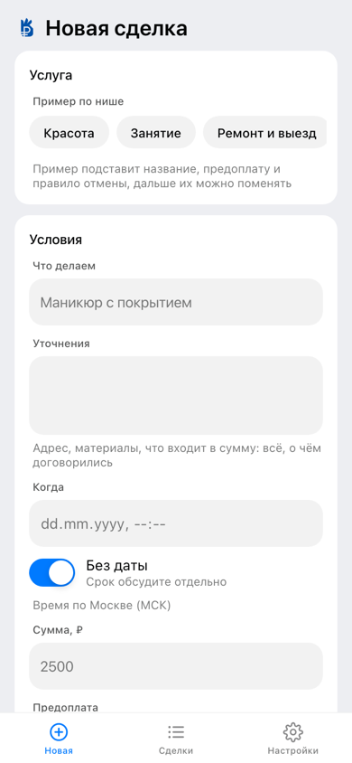
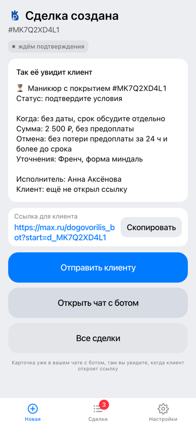
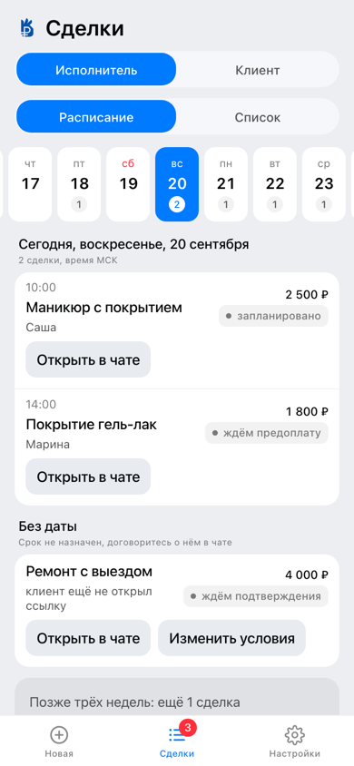
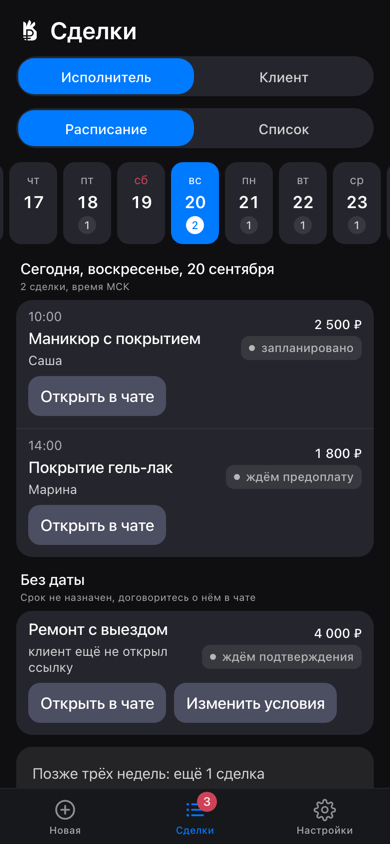
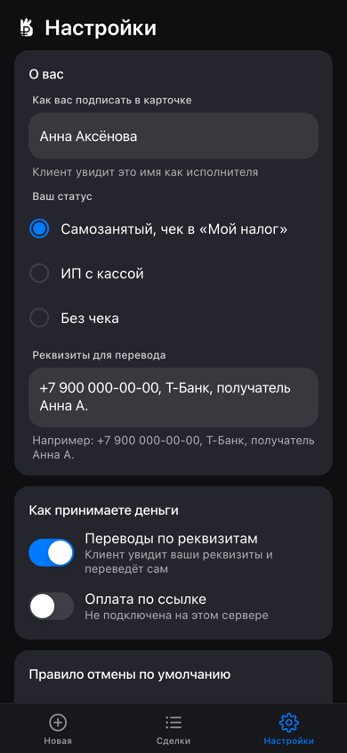
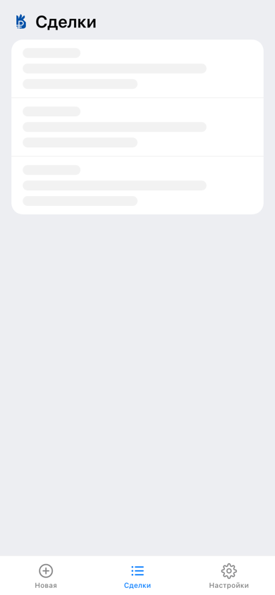
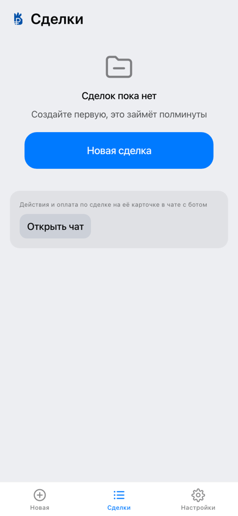
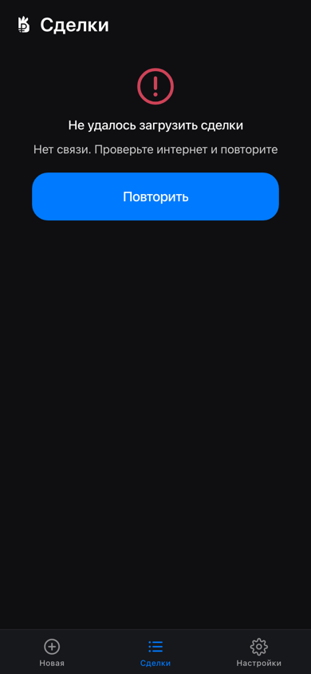
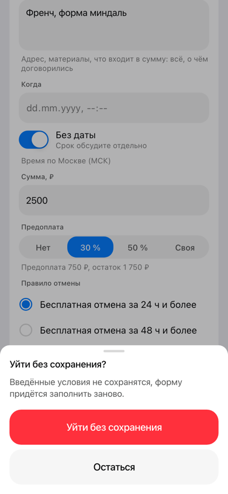
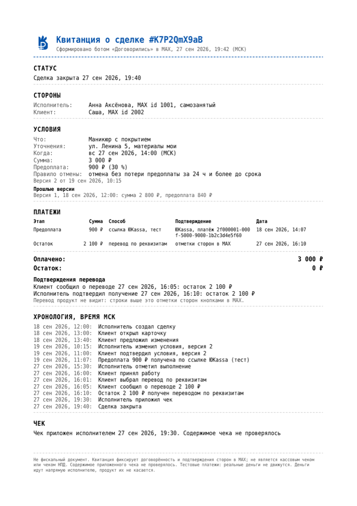

# Договорились: подтверждённая договорённость в чате MAX

Проект команды Pulsar (Алексанян Екатерина, Качалкина Александра, Колесников Павел) для хакатона MAX 2026, трек «Эффективный бизнес».

> Статус: работает на сервере. Основной сценарий проходится двумя аккаунтами, проверено вживую 29.09.2026
> (сделка `gbLbTTJ15X`; журнал прогонов хранится вне репозитория).
> Бот в MAX: `@t713_hakaton_max_bot`. Сервер: `https://91-186-197-163.sslip.io` (режим `webhook`, ЮKassa в тестовом магазине).
> Версия: тег `v1.3`, выложена на сервер вечером 29.09.2026. Точный commit hash указан на служебном слайде презентации.
> Что в решении настоящее, а что смоделировано, показывают таблица в §8 и `docs/SPEC.md` §18.
> README входит в оценку (10 % технической части).
>
> Это версия к финалу. В ней обновлено оформление бота и мини-приложения и добавлены новые функции: нижняя панель
> разделов и кнопка «назад» по истории экранов, экран сделки в мини-приложении, «Мои услуги» исполнителя, «Другое время»
> из календаря с учётом занятости исполнителя, надёжность исполнителя и оценка клиента.

## 1. Назначение решения

Самозанятый или микро-ИП фиксирует договорённость с клиентом карточкой в чате MAX: что, когда, сколько, предоплата,
правило отмены. Клиент подтверждает её одной кнопкой. Предоплата и остаток проходят выбранным способом оплаты, статус
обновляется у обеих сторон. Бот напоминает о визите, оплате и чеке, а по завершении обе стороны получают чек и квитанцию PDF.
Деньги идут напрямую исполнителю: сервис их не принимает и реквизиты карт не хранит.

Ссылка на оплату в этой версии создаётся в **тестовом магазине ЮKassa команды**, чтобы
интеграция была видна целиком: создание платежа, вебхук, статусы, отказы, истечение срока. В продукте за ссылкой стоит
собственный эквайринг исполнителя: у ИП это его магазин ЮKassa или Т-Бизнес по API, у самозанятого СБП-ссылка банка
или перевод по реквизитам. Платформа деньги не принимает, не держит и не распределяет. Она не платёжный агент (103-ФЗ),
не эскроу и не пробивает чеки за исполнителя: обязанности по 54-ФЗ и 422-ФЗ остаются на нём. Продукт даёт
зафиксированную договорённость, статус у обеих сторон и квитанцию, которую можно предъявить как доказательство.
Подробно в `docs/SPEC.md` §9.1.

Обоснование, аудитория и цитаты пользователей собраны в `docs/КОНЦЕПЦИЯ.md`, спецификация в `docs/SPEC.md`,
план масштабирования в `docs/SCALING.md`.

## 2. Основной пользовательский сценарий

1. Исполнитель отправляет `/start`, нажимает «Новая сделка» и в мини-приложении заполняет форму: шаблон, что, когда,
   сумма, предоплата, правило отмены. Затем нажимает «Создать».
2. Бот присылает карточку и ссылку `https://max.ru/<бот>?start=d_<id>`. Исполнитель отправляет ссылку клиенту в чат,
   где они уже переписываются.
3. Клиент открывает ссылку, видит карточку и нажимает «Подтверждаю». Затем вносит предоплату: по ссылке эквайринга
   **[тест]** или переводом по реквизитам, где клиент отмечает «перевёл», а исполнитель «получил».
4. Исполнитель нажимает «Выполнено», клиент нажимает «Принимаю» и оплачивает остаток тем же способом.
5. Исполнитель прикладывает чек из «Мой налог», и обе стороны получают чек и квитанцию PDF. Статусы у обеих сторон
   обновляются на месте, в тех же сообщениях.

Демо-режим «🧪 Открыть как клиент» даёт пройти весь сценарий одним аккаунтом. Он помечен в интерфейсе и в квитанции.

Что есть вокруг основного сценария:
- Правка условий: клиент нажимает «Предложить изменения», исполнитель нажимает «Изменить условия» и правит сделку
  в мини-приложении в той же форме. Клиент получает версию 2 со списком изменений («когда: …; сумма: …») и подтверждает
  именно её. Кнопка прежней версии уже не срабатывает.
- Другое время: после «Предложить изменения» клиент выбирает «Другое время» или «Написать текстом». «Другое время»
  открывает календарь на 30 дней с шагом 30 минут, с 08:00 до 21:30 МСК. Часы, когда исполнитель занят, недоступны
  с учётом длительности работы. Исполнитель получает кнопку «Принять {время}»: одно нажатие создаёт новую версию
  условий, и клиент подтверждает её как обычно. Если это время уже успели занять, предложение снимается, и обе стороны
  получают понятный следующий шаг.
- Напоминания: за 30 минут до визита обеим сторонам. Каждое утро в выбранное время исполнитель получает расписание
  на сегодня, если на этот день есть сделки. Время задаётся в «Настройках»: по умолчанию 08:00 МСК, можно выбрать
  от 06:00 до 12:00 или «выключено». Кроме того, бот напоминает о предоплате, приёмке работы, остатке и чеке.
- «Сделки»: вкладки «Исполнитель» и «Клиент», расписание по дням (с 7 дней назад до 21 дня вперёд) и список
  с фильтрами. В чате то же самое кратко показывает команда `/deals`.
- Навигация в мини-приложении: нижняя панель с разделами «Новая», «Сделки» и «Настройки» есть на всех экранах.
  Кнопка «назад» в MAX ведёт по пройденным экранам, а на экране, с которого приложение открыли, закрывает его.
- Экран сделки открывается из строки в «Сделках», кнопкой «К сделке» на экране «Готово» или по `startapp=deal_<id>`.
  На нём условия, стороны, деньги, хронология, история версий, документы и ровно те действия, что есть на карточке
  в чате (они берутся из её клавиатуры). Действие с экрана проходит тем же путём, что нажатие кнопки в чате: карточки
  обеих сторон обновляются, вторая сторона получает сообщение. Исполнитель может приложить чек файлом прямо с экрана.
  Оплата остаётся в чате.
- «Мои услуги» (в «Настройках»): сохранённые условия, то есть название, сумма, длительность, предоплата и правило
  отмены. В «Новой сделке» блок «Выбрать услугу» подставляет всё, кроме даты, а заполненную форму можно сохранить
  кнопкой «Сохранить как услугу». Клиент список услуг не видит: это инструмент исполнителя, а не витрина.
- Надёжность и оценка: исполнитель видит в «Настройках» показатели по фактам своих сделок (закрыто, без споров,
  чек в срок, отмены с его стороны, средняя оценка). Если исполнитель включит переключатель (по умолчанию он выключен)
  и у него 3 или больше закрытых сделок, клиент увидит в карточке строку «Надёжность: 12 сделок, 98 % без споров».
  После закрытия сделки клиенту приходит просьба оценить работу от 1 до 5 с необязательным комментарием. Оценку видит
  только исполнитель, публичного рейтинга нет.
- «Повторить сделку» у завершённой сделки открывает те же условия без даты. С отметкой «Тот же клиент» карточка
  уходит этому клиенту сразу, без ссылки.

## 3. Состав и архитектура решения

Решение состоит из одного процесса Node.js (бот, HTTP и планировщик) и одной базы Postgres. Второго процесса нет
намеренно: так запуск укладывается в одну команду и точек отказа меньше. Схема компонентов в `docs/SPEC.md` §4.1.

```
server/src/
  index.ts                 запуск по порядку: конфиг, БД (с повторными попытками), миграции, HTTP, бот, планировщик
  config.ts                чтение и проверка env (zod), при ошибке exit(1) с понятным текстом
  texts.ts                 тексты бота и уведомлений (SPEC §6); тексты квитанции лежат в domain/receipt
  types.ts errors.ts logger.ts shutdown.ts
  transport/bot/            обработчики MAX: start, menu, deal, payment, input; карточки, клавиатуры, уведомления
  transport/http/           Fastify: /api для мини-приложения, /pay/return, статика /app/, проверка initData
  domain/                   бизнес-логика: deal/{state-machine,rules,service}, payment, reminder, receipt,
                            schedule (занятость исполнителя), services (услуги), ratings (оценки),
                            reliability (надёжность), money, time, ids, templates
  integrations/max/         gateway, единственный выход в Bot API: ограничение частоты, повторы, типизированные ошибки
  integrations/yookassa/    клиент API ЮKassa
  db/                       pool, migrate, repos/* с SQL-запросами
  scheduler/                цикл каждые 30 с: напоминания, утренняя сводка, истечение срока подтверждения,
                            сторож подписки MAX; jobs/payments-poll: опрос статуса платежей по ссылке
webapp/src/                 мини-приложение: bridge, api, nav (история «назад»), экраны New / Done / Deals / Deal / Settings,
                            свои компоненты на токенах MAX UI (панель разделов, лист снизу, всплывающее сообщение,
                            переключатель вкладок)
server/migrations/*.sql     схема БД; миграции применяет небольшой модуль db/migrate.ts
```

Правило слоёв (за ним следим при проверке кода): состояние сделки и деньги меняет только `domain`, и все переходы
сделки идут через машину состояний, то есть через одну функцию `canTransition`, в транзакции с `SELECT … FOR UPDATE`.
`transport` читает БД, чтобы отрисовать ответ, а сам записывает только служебные данные: ожидание ввода, id
сообщений-карточек, профиль, журнал вебхуков. `domain` не знает ни про SDK MAX, ни про HTTP; `integrations` содержит
тонкие клиенты внешних API.

## 4. Запуск одной командой (Docker)

```bash
cp .env.example .env          # по умолчанию MAX_MODE=off: токен бота и ключи провайдера можно не заполнять
docker compose up --build     # сервис на http://localhost:8080 , БД внутри compose
```
По умолчанию в `.env.example` стоит `MAX_MODE=off`: поднимаются API, мини-приложение и БД без бота, токен не нужен.
Бот проверяется в MAX на развёрнутом сервере (сценарий в §11). Режим длинного опроса (long polling, `MAX_MODE=polling`)
включайте только с отдельным токеном: с токеном боевого бота он снимет вебхук сервера (подробнее ниже в этом разделе).

Замеры 29.09.2026. Базовые образы `node:22-alpine` и `postgres:16-alpine` скачаны заранее (`docker pull`), как это
будет и у проверяющего. `docker compose build --no-cache` занимает 46 с, `docker compose up --build` из чистой
выгрузки репозитория 34 с, после этого сервис получает статус `healthy` примерно через 15 с. При старте применяются
8 миграций. В образ входят `server/assets/logo.png` и `webapp/dist`. Лимит регламента 5 минут.

Без Docker из чистого клона: `npm ci` занимает 39 с на холодном кэше npm и 2 с на тёплом, `npm run build` 6 с.
`npm test` прогоняет 1068 тестов (978 тестов сервера и 90 тестов мини-приложения) примерно за 6,5 мин с
`TEST_DATABASE_URL` (29.09). Сквозные тесты работают с настоящим ограничением частоты отправки (2 сообщения
в секунду), поэтому идут небыстро.

Проверка после запуска:
```bash
curl http://localhost:8080/healthz   # {"ok":true,"service":"dogovorilis","mode":"off"}
curl http://localhost:8080/readyz    # {"ok":true,"db":true,"bot":true}
curl -i http://localhost:8080/api/me # 401 {"error":{"code":"init_data_invalid",...}}, без initData так и должно быть
```
При `MAX_MODE=off` поле `bot` в `/readyz` тоже равно `true`: бот в этом режиме не требуется.

Рабочий запуск с HTTPS на VPS: `docker compose --profile prod up -d --build`. Caddy выпускает сертификат
Let's Encrypt для `PUBLIC_HOST`. Развёртывание автоматизировано: `deploy/bootstrap-server.sh` готовит сервер,
`deploy/deploy.sh` выкладывает код и проверяет результат. Инструкция по эксплуатации (обновление, логи, откат,
резервная копия, разбор ситуации «бот молчит», управление сервером через API Timeweb) лежит в `deploy/README.md`.

Сервер развёрнут 21.09.2026 на Timeweb Cloud (Cloud-50, зона `spb-3`, Ubuntu 24.04, 2 × 3.3 ГГц / 4 ГБ / 50 ГБ NVMe),
версия к финалу выложена на него 29.09.2026. На сервере проверено: `/healthz` и `/readyz`
(`{"ok":true,"db":true,"bot":true}`) отвечают 200, `/app/` отвечает 200, сертификат Let's Encrypt выпущен, миграции
применяются при старте (сейчас их восемь, с `0001` по `0008`), бот работает в режиме `webhook`, и его подписка
зарегистрирована в MAX. Процесс переживает падение (проверено 21.09): после `kill -9` контейнер поднялся сам
(`restart: unless-stopped`, `RestartCount=1`) и заново зарегистрировал подписку.

**Нужен сертификат Минцифры.** `platform-api2.max.ru` предъявляет цепочку сертификатов Russian Trusted Sub CA
и Russian Trusted Root CA, а Node по умолчанию ей не доверяет: в его наборе корневых сертификатов нет ни одного
российского. Файл `certs/russian_trusted_bundle.pem` лежит в репозитории (сертификаты публичные), образ запускается
с `NODE_EXTRA_CA_CERTS`. Как собрать файл заново, описано в `certs/README.md`.

> Один токен бота обслуживает только один работающий экземпляр. Локальный запуск с боевым токеном в режиме
> `MAX_MODE=polling` **удалит подписку на вебхук** у развёрнутого экземпляра.
> Сервер восстановит её сам в течение 5 минут (сторож подписки, `deploy/README.md` §5), но всё это время бот в MAX
> молчит. Чтобы проверить сборку без бота, используйте `MAX_MODE=off`.

## 5. Параметры окружения и переменные

Переменные задаются в `.env` (образец с комментариями: `.env.example`). При старте `server/src/config.ts` проверяет
их и при ошибке завершает процесс с понятным текстом (`exit(1)`). Та же таблица в `docs/SPEC.md` §4.3.

| Переменная | Обязательна | По умолчанию | Назначение |
|---|---|---|---|
| `MAX_MODE` | да | `off` в `.env.example` | как бот получает события: `off` (без бота), `polling` (длинный опрос, локально), `webhook` (сервер с HTTPS) |
| `MAX_BOT_TOKEN` | при `polling` и `webhook` | пусто | токен бота MAX от организаторов; хранится только в `.env` |
| `PUBLIC_BASE_URL` | да | `http://localhost:8080` в `.env.example` | публичный адрес сервиса для мини-приложения, вебхуков и возврата после оплаты; при `webhook` только `https://` |
| `MAX_BOT_USERNAME` | нет | пусто, тогда ник берётся из `GET /me` при старте | ник бота без @ для ссылок `https://max.ru/<ник>?start=…`; compose передаёт его и в сборку мини-приложения |
| `MAX_WEBHOOK_SECRET` | при `webhook` | пусто | секрет подписки MAX: от 5 до 256 символов `[A-Za-z0-9_-]` |
| `PUBLIC_HOST` | в профиле `prod` | `localhost` | домен, для которого Caddy выпускает сертификат |
| `POSTGRES_USER`, `POSTGRES_PASSWORD`, `POSTGRES_DB` | нет | `dogovorilis` | пользователь, пароль и имя базы в compose |
| `DATABASE_URL` | да | в Docker собирается compose из `POSTGRES_*` | строка подключения к Postgres; вне Docker задайте её сами |
| `PAYMENT_PROVIDER` | да | нет (в `.env.example` стоит `none`) | оплата по ссылке: `none` (только перевод по реквизитам) или `yookassa` (тестовый магазин); `tbank` не подключён |
| `YOOKASSA_SHOP_ID`, `YOOKASSA_SECRET_KEY` | при `yookassa` | пусто | ключи тестового магазина ЮKassa |
| `TBANK_TERMINAL_KEY`, `TBANK_TERMINAL_PASSWORD` | при `tbank` | пусто | Т-Банк не подключён, оставьте пустыми |
| `DEMO_MODE` | нет | `true` | кнопка «Открыть как клиент» для проверки одним человеком |
| `APP_TIMEZONE` | нет | `Europe/Moscow` | часовой пояс для дат |
| `PORT` | нет | `8080` | порт сервиса |
| `LOG_LEVEL` | нет | `info` | уровень логов: `fatal`, `error`, `warn`, `info`, `debug`, `trace`, `silent` |
| `NODE_ENV` | нет | `production` | `development` нужен только для локальной разработки с `DEV_FAKE_USER_ID` |
| `DEV_FAKE_USER_ID` | нет | пусто | только при `NODE_ENV=development`: подставляет пользователя вместо initData, чтобы открыть мини-приложение в браузере без MAX; с `https://` в `PUBLIC_BASE_URL` сервис не стартует |
| `TEST_DATABASE_URL` | только для тестов | пусто | база для сквозных тестов; без неё они пропускаются (§7.1) |

## 6. Порты

- `8080`: сервис (HTTP: API, вебхуки, мини-приложение), номер меняется через `PORT`. Порт публикуется только
  на `127.0.0.1` хоста (`"127.0.0.1:${PORT:-8080}:8080"` в `compose.yaml`). Локально `http://localhost:8080`
  работает как обычно, а на сервере порт 8080 снаружи закрыт: весь трафик идёт через Caddy (80/443), который
  обращается к `app:8080` по внутренней сети compose. Заголовок `X-Forwarded-For` приложение принимает только
  от прокси с loopback-адреса или из частных сетей (Caddy в сети Docker), поэтому подделать IP клиента снаружи нельзя.
  На `/webhooks/*` действует ограничение: 600 запросов в минуту с одного IP (`@fastify/rate-limit`), сверх него
  сервер отвечает `429`.
- `5432`: Postgres внутри сети compose, наружу не публикуется.
- `80/443`: Caddy (только в профиле `prod`).

## 7. Зависимости

Версии зафиксированы точно (без `^`) в `package.json`, `server/package.json` и `webapp/package.json`; файл
блокировки версий `package-lock.json` хранится в репозитории.
Основные: Node 22, `@maxhub/max-bot-api` 0.3.1, `@maxhub/max-ui` 0.5.0, react 19.2.8, fastify 5.12.5, pg 8.23.0,
pdfkit 0.20.2 со шрифтом `dejavu-fonts-ttf`, zod 4.6.5, pino 10.3.1, vitest 5.0.1, vite 7.3.6, typescript 5.9.3,
`@fastify/rate-limit` 11.2.0 (лимит на `/webhooks/*`).

В корневом `package.json` задано `overrides: { "vite": "7.3.6" }`, чтобы во всём монорепозитории был один Vite.
Без этого `vitest` подтягивал в корень vite 8, `@vitejs/plugin-react` находил именно его, и сервер разработки
мини-приложения (vite 7) отвечал 500 на каждый `.tsx`. На сборку это не влияло. Подробности в `docs/ДОПУЩЕНИЯ.md`.

## 7.1. Разработка и тесты

```bash
npm ci
npm run lint          # проверка типов: server (вместе с тестами) и webapp
npm test              # 1068 тестов: сервер (978) и мини-приложение (90); сквозные пропускаются без TEST_DATABASE_URL
npm run check:secrets # поиск секретов в изменениях из индекса git (пример хука: .githooks-pre-commit.sample)
```
Для сквозных тестов нужен Postgres. Создайте базу и укажите её:
```bash
createdb dogovorilis_test
TEST_DATABASE_URL=postgres://$(whoami)@localhost:5432/dogovorilis_test npm test
```
Как устроены сквозные тесты: MAX подменён на уровне HTTP (`clientOptions.fetch` у SDK), а база и цепочка
обработчиков настоящие. Поэтому проверяется ровно то, что ушло бы в сеть. Сценарий от T1 до T15 проходится
в демо-режиме одним аккаунтом, двумя аккаунтами по ссылке, повторно (проверка идемпотентности и того, что состояние
не протекает) и с граничными случаями из `docs/SPEC.md` §14. Отдельно проверены ограничение
2 сообщения в секунду на чат, обновление карточек на месте и контракт API мини-приложения.

Локальный запуск без Docker: поднимите Postgres, задайте `DATABASE_URL`, затем выполните `npm run dev:server`
и в другом терминале `npm run dev:webapp`. **Не запускайте локальный бот с боевым токеном, пока работает
развёрнутый:** режим `polling` удалит подписки на вебхук. Для проверки сборки используйте `MAX_MODE=off`.

## 8. Внешние сервисы и интеграции

| Сервис | Назначение | Режим | Условия проверки |
|---|---|---|---|
| MAX Bot API (`platform-api2.max.ru`) | бот, карточки, вложения | реальный | токен организаторов; корневой сертификат Минцифры (`certs/README.md`) |
| MAX Bridge / мини-приложение | форма сделки, список | реальный | URL мини-приложения привязан организаторами |
| Timeweb Cloud API | создание и администрирование сервера | реальный | токен хранится вне репозитория; что можно и чего нельзя, описано в `deploy/README.md` §8 |
| ЮKassa API v3 | ссылка на оплату, вебхук статуса | подключено: реальный API тестового магазина, деньги не движутся | тестовые карты (см. §10); вебхуку нужен HTTPS (см. §13) |
| Т-Банк Интернет-эквайринг | не используется | не подключён по решению команды: одного настоящего провайдера достаточно, чтобы показать интеграцию целиком | нет |
| «Мой налог» (ФНС) | чек НПД | не интегрирован (нет публичного API) | исполнитель прикладывает чек файлом, в квитанции пометка «содержимое не проверялось» |

### Что настоящее, что тестовое и что смоделировано

Таблица из `docs/SPEC.md` §18 (там же пояснения):

| Элемент | Статус | Пометка в интерфейсе |
|---|---|---|
| Бот, карточки, ссылки с параметром запуска, мини-приложение, initData | настоящее | нет |
| Оплата по ссылке через ЮKassa | тест: настоящий API и вебхук тестового магазина | в сообщении со ссылкой «🧪 Тестовый магазин: подойдёт карта … Деньги не списываются», после оплаты в карточке «🧪 Тестовый магазин, деньги не списывались» |
| Оплата СБП через Т-Банк | не подключена (решение 22.09, `docs/SPEC.md` §9.3) | нет |
| Перевод по реквизитам | модель: факт перевода подтверждают стороны | «🧪 Перевод продукт не видит, его подтверждают обе стороны кнопками» |
| Чек НПД | модель: исполнитель прикладывает файл из «Мой налог» | просьба сформировать чек в «Мой налог»; в квитанции «содержимое не проверялось» |
| Квитанция PDF | настоящая, но не фискальный документ | строка «Не фискальный документ» внизу квитанции |
| Возврат предоплаты | модель: обязательство по правилу отмены плюс факт возврата, который стороны подтверждают кнопками (`docs/SPEC.md` §5.3) | строка в карточке и в квитанции |
| Демо-режим | модель | префикс 🧪, водяной знак «ДЕМО» |

### Что не воспроизводится в Docker

| Что | Зачем нужно | Почему не работает локально | Как проверить |
|---|---|---|---|
| MAX Bot API | бот, карточки, уведомления | нужен токен бота, а на один токен работает только один экземпляр; поэтому по умолчанию `MAX_MODE=off` | в MAX на развёрнутом сервере по сценарию §11; локально только с отдельным токеном в режиме `polling` |
| Привязка мини-приложения к боту | кнопки бота открывают мини-приложение внутри MAX | привязка делается через форму организаторов и указывает на адрес развёрнутого сервера | кнопками «Новая сделка», «Сделки», «Настройки» в боте на сервере |
| Вебхуки ЮKassa и MAX | мгновенное обновление статуса оплаты и доставка событий бота | принимаются только по HTTPS на порту 443 с доверенным сертификатом (ЮKassa также на 8443), поэтому работают только на сервере | на сервере: оплатить тестовой картой, карточка обновится сама; локально оплата подтверждается опросом статуса и кнопкой «Проверить оплату» (§13) |

## 9. Работа с данными

Что хранится: пользователи MAX (id, имя, chat_id диалога; телефон только после проверки HMAC, в интерфейсе он
показан маской), сделки и версии условий, платежи (id у провайдера и статусы, без реквизитов карт), события,
напоминания, вложения с чеками (токены MAX), услуги исполнителя, предложения другого времени, оценки клиентов
и настройки исполнителя (время утренней сводки, показ надёжности).
Схему задают миграции: `server/migrations/0001_init.sql` создаёт основные таблицы, `0002_payments_provider.sql`
и следующие, до `0008_reliability_and_ratings.sql`, её дополняют. Миграции применяются автоматически при старте.
Реквизиты для перевода хранятся как текст, который исполнитель сам показывает клиенту.
Доставки вебхуков записываются в `webhook_log`; для чужих и повреждённых запросов хранится только сводка
(событие, id объекта, размер), без тела.

## 10. Порядок работы с тестовыми данными

Всё смоделированное помечено в интерфейсе. Таблица, что настоящее и что смоделировано, приведена в §8
(источник: `docs/SPEC.md` §18).

- Демо-сделка: в меню `/start` (или в `/new`) нажмите «🧪 Попробовать», затем «🧪 Демо: пройти одному». Условия-пример:
  «Маникюр с покрытием», завтра в 14:00, 2 500 ₽, предоплата 500 ₽. Пометки демо: «🧪 Демо: так видит клиент» в начале
  карточки клиента, «, демо» после номера сделки у исполнителя, значок «демо» в списке, диагональный водяной знак
  «ДЕМО» в квитанции PDF.
- Реквизиты для перевода у демо-сделки заведомо нерабочие и подписаны «(данные-пример)».
- Напоминания в демо ускорены: «примите работу» (клиенту) и «не забудьте чек» (исполнителю) приходят через 2 минуты
  вместо суток с пометкой «🧪 В демо ускорено». Остальные сроки такие же, как в настоящей сделке (`docs/SPEC.md` §10.2).
- Перевод по реквизитам смоделирован: факт перевода обе стороны подтверждают кнопками, а продукт денег не касается.
  Это прямо написано в сообщении клиенту.
- Чек: подойдёт любой файл (фото или PDF). В этой версии он только прикладывается и пересылается клиенту, фискального
  значения у него нет, и квитанция прямо об этом говорит.
- Оплата по ссылке идёт через настоящий API ЮKassa, но **тестового магазина**: запросы, вебхуки и статусы настоящие,
  а деньги не движутся. Включается через `PAYMENT_PROVIDER=yookassa` с ключами тестового магазина.
  В сообщении со ссылкой сразу подсказано, что вводить: «🧪 Тестовый магазин: подойдёт карта 5555 5555 5555 4444,
  любая будущая дата и любой CVC. Деньги не списываются». После оплаты в карточке появляются строки «Предоплата 500 ₽
  получена 26 сен, 17:24 по ссылке ЮKassa» и отдельно «🧪 Тестовый магазин, деньги не списывались».

  Тестовые карты (срок действия: любая будущая дата; CVC и код 3-DS: любые цифры):

  | Карта | Что произойдёт |
  |---|---|
  | `5555 5555 5555 4444` | оплата пройдёт сразу, без 3-DS; в карточке «Предоплата … получена», сделка идёт дальше |
  | `5555 5555 5555 4477` | оплата пройдёт после экрана 3-DS |
  | `5555 5555 5555 4600` | отказ «недостаточно средств»; в карточке появятся причина и кнопка «Новая ссылка» |
  | `5555 5555 5555 4543` | отказ «истёк срок действия карты» |

  Ссылка действует 1 час (срок оплаты картой у ЮKassa). Потом платёж переходит в статус `expired`, в карточке
  появляются строка «Ссылка на оплату … истекла, нужна новая» и кнопка «Новая ссылка», так что сценарий продолжается.
- Т-Банк СБП не подключён (решение команды). При `PAYMENT_PROVIDER=none` кнопка «Оплатить по ссылке» отвечает
  «Оплата по ссылке не подключена».

## 11. Пошаговый сценарий проверки

Проверку проходит один человек за пару минут. Бот: **https://max.ru/t713_hakaton_max_bot**

### Вариант А: одним аккаунтом (демо-режим)
1. Откройте бота по ссылке выше и нажмите «Начать» (или отправьте `/start`).
2. В меню нажмите «🧪 Попробовать», затем «🧪 Демо: пройти одному». В чат придут две карточки: ваша (исполнителя)
   и карточка с пометкой «🧪 Демо: так видит клиент». Обе относятся к одной сделке, и обе обновляются.
3. В **демо-карточке** нажмите «Подтверждаю». Статус изменится в обеих карточках, и вам придёт уведомление.
4. Внесите предоплату одним из двух способов:
   - Нажмите «Оплатить по ссылке», затем кнопку «Оплатить 500 ₽». Введите карту `5555 5555 5555 4444`, срок действия
     любой будущий, CVC любой. После оплаты вернитесь в MAX: карточка обновится сама (на сервере по вебхуку, при
     локальном запуске через опрос в течение минуты). Чтобы не ждать, нажмите «Проверить оплату».
   - Нажмите «Перевести по реквизитам»: реквизиты появятся прямо в демо-карточке. Нажмите «Я перевёл(а)»
     и переходите к шагу 5.
5. Если платили переводом, нажмите «Получил(а)» в **своей** карточке (или в пришедшем сообщении). При любом
   способе оплаты сделка переходит в статус «запланировано».
6. В **своей** карточке нажмите «Выполнено», затем в демо-карточке нажмите «Принимаю».
7. Оплатите остаток тем же способом (по ссылке или переводом).
8. Нажмите «Приложить чек» и отправьте любое фото или PDF одним сообщением. Если задержаться на шаге 6 или 8 дольше
   2 минут, придёт напоминание с кнопкой «Приложить чек» или «Открыть сделку» и пометкой «🧪 В демо ускорено».
9. Итог: обе карточки отмечены ✅ и показывают «Статус: сделка закрыта, квитанция отправлена». В чат приходят
   квитанция PDF в виде кассового чека (с водяным знаком «ДЕМО») и пересланный чек.

### Вариант Б: двумя аккаунтами (настоящий клиент)
1. С первого аккаунта создайте сделку: в меню нажмите «🧪 Попробовать», затем «Пример: позвать клиента». Это настоящая
   сделка с условиями-примером, она создаётся прямо из чата одним нажатием. Сделку со своими условиями можно
   создать через «Новая сделка» в мини-приложении.
2. В карточке нажмите «Отправить клиенту»: откроется выбор чата с готовым текстом «Подтвердите условия:
   {что}, {когда} (МСК)» и одной ссылкой. Другой путь: нажмите «Скопировать ссылку» и отправьте её второму аккаунту.
3. Со второго аккаунта откройте ссылку. Бот поздоровается и покажет карточку клиента, а первому аккаунту придёт
   «👀 … открыл(а) карточку».
4. Дальше пройдите шаги с 3 по 9 варианта А. Клиентские кнопки нажимает второй аккаунт, а «Получил(а)», «Выполнено»
   и «Приложить чек» нажимает первый.
5. Команда `/deals` в любой момент показывает каждому аккаунту его разделы «Вы исполнитель» и «Вы клиент»: дата,
   название со ссылкой на карточку, сумма и статус словом. Под списком кнопки вида «Пн 28 сен, 14:00, Маникюр…»
   и кнопка «Сделки».
6. Правка условий (до подтверждения): второй аккаунт нажимает «Предложить изменения», выбирает «Написать текстом»
   и пишет, что поменять. Первому приходит уведомление с кнопкой «Изменить условия», которая открывает
   мини-приложение сразу на форме этой сделки. Поменяйте дату или сумму и нажмите «Отправить новые условия».
   Второй аккаунт получит «Исполнитель изменил условия …, версия 2: когда: …; сумма: …», в карточке появится
   «Версия 2, условия изменены …», и «Подтверждаю» подтвердит версию 2. Если вместо текста выбрать «Другое время»,
   исполнитель получит кнопку «Принять {время}». То же самое можно пройти одним аккаунтом в демо-сделке.
7. Повтор (после закрытия): откройте «Сделки», затем «Список» и «Закрытые», нажмите «Повторить сделку» (или ту же
   кнопку в карточке). Условия подставлены, дата пустая, включено «Тот же клиент: {имя}». Нажмите «Создать
   и отправить клиенту»: карточка сразу придёт второму аккаунту, без ссылки и пересылки.
8. «Сделки», вкладка «Расписание»: лента дней, под датой число сделок, ниже сделки дня по времени. Внизу каждого
   экрана панель «Новая», «Сделки», «Настройки»; на «Сделках» счётчик сделок, где нужен ваш ход.

### Что стоит попробовать сломать
- Нажать «Подтверждаю» дважды: бот ответит «Это уже сделано, карточка актуальна», второго события не будет.
- Оплатить картой `5555 5555 5555 4600` (недостаточно средств): в карточке появятся причина отказа и кнопка
  «Новая ссылка», сценарий продолжается.
- Нажать «Оплатить по ссылке» дважды: вторая ссылка не создаётся, бот выдаёт ту же.
- Создать ссылку и, не оплачивая, нажать «Перевести по реквизитам»: платёж по ссылке отменяется, начинается
  перевод. У сделки всегда не больше одного действующего платежа каждого вида.
- Написать боту произвольный текст, когда он не ждёт ввода: ответ «Я понимаю только кнопки и команды».
- Прислать вместо чека документ `.docx`: ответ «Нужен файл или фото», бот продолжит ждать чек.
- Открыть чужую демо-ссылку с третьего аккаунта: ответ «Это демо-сделка исполнителя, к ней нельзя присоединиться».
- После «Выполнено» у клиента нет кнопки «Отменить», остаются «Принимаю» и «Есть замечания». Запрет держит и сервер:
  запрос отмены от клиента на этом шаге получает ответ «После выполнения работы отменить сделку можно только
  по согласованию с исполнителем» (проверяется тестами `state-machine`, `deal-screen`, `e2e-scenario`).

## 12. Примеры ожидаемого поведения

Оформление и тексты сделаны по `docs/DESIGN_BRIEF.md` (редизайн, ЗАДАЧА_07): без тире и точек-разделителей,
статус словом, одна главная кнопка. Карточка сделки у клиента, который должен внести предоплату (это сообщение бота,
оно обновляется на месте):
```
💳 **Маникюр с покрытием** #K7P2QmX9aB
Статус: внесите предоплату 900 ₽

Когда: вс 27 сен, 14:00 (МСК)
Сумма: **3 000 ₽**, предоплата **900 ₽** (30 %)
Отмена: без потери предоплаты за 24 ч и более до срока
Уточнения: ул. Ленина 5, материалы мои

Исполнитель: Анна Аксёнова
Клиент: Саша
Предоплата 900 ₽ ждёт оплаты
```
Кнопки: [Оплатить по ссылке] [Перевести по реквизитам] [Отменить сделку]. В уведомлении второй стороне сначала
идёт факт, затем действие, кнопка одна:
```
💸 Предоплата 900 ₽ по #K7P2QmX9aB получена по ссылке ЮKassa.
🧪 Тестовый магазин, деньги не списывались.
Всё согласовано. Отметьте «Выполнено», когда закончите.
```
Все карточки в 12 статусах и трёх ролях с кнопками и кодами callback собраны в `server/test/__snapshots__/cards.md`,
все уведомления и напоминания в `server/test/__snapshots__/notifications.md` (снимки сверяются тестами). Тексты лежат
в `server/src/texts.ts`, эталон в `docs/SPEC.md` §6.

Мини-приложение в светлой и тёмной теме (снимки сделаны с заглушкой вместо API):

| Новая сделка | Готово | Сделки, расписание | Сделки, тёмная тема | Настройки, тёмная тема |
|---|---|---|---|---|
|  |  |  |  |  |

Состояния экрана: при загрузке показывается заготовка экрана (скелет), пустой экран предлагает действие, при ошибке
есть кнопка «Повторить», об успехе сообщает всплывающее сообщение (Snackbar). Если с заполненной формы перейти
по панели, приложение спросит «Уйти без сохранения?»:

| Загрузка | Пусто | Ошибка | Уйти без сохранения |
|---|---|---|---|
|  |  |  |  |

Квитанция PDF в виде кассового чека: 

Сообщения об ошибках, которые может увидеть проверяющий: «Это действие уже недоступно, карточка обновлена» (нажата
устаревшая кнопка), «Оплата по ссылке не подключена. Доступен перевод по реквизитам», «Нужен файл или фото. Пришлите чек
вложением», «Слишком длинно: нужно до 500 символов. Сократите и пришлите ещё раз», «Время ожидания истекло. Нажмите
кнопку ещё раз».

## 13. Известные ограничения

Ограничения платформы:
- Бот не может написать первым. `chat_id` диалога появляется только после того, как человек сам открыл бота,
  поэтому клиент должен один раз перейти по ссылке. Если он этого не сделал, уведомления ему не уходят (в логах это
  видно как `reminder.skipped {reason:'no_chat'}`), но сделка продолжает работать.
- Клиент без установленного MAX не теряется: вне MAX ссылка `https://max.ru/<бот>?start=…` открывает визитку бота
  с кнопкой «Открыть в браузере» (web.max.ru). Проверено вживую 21.09.
- Бот не может создать общий чат сторон, поэтому карточка состоит из двух сообщений (по одному у каждой стороны)
  с общим состоянием.
- На один токен приходится один работающий экземпляр: запуск в режиме `polling` удаляет подписки на вебхук для этого
  токена. Развёрнутый сервер восстанавливает свою подписку: сторож проверяет её раз в 5 минут, а `/readyz` показывает
  `subscription: true|false`. Для проверки сборки без бота используйте `MAX_MODE=off`.
- Мини-приложение привязывается к боту через форму организаторов, а не через API. Для нашего бота привязка сделана
  и проверена вживую. Если привязка недоступна, сценарий проходится демо-сделкой из меню и командой `/new`.
- Вебхук платежей требует HTTPS. ЮKassa доставляет уведомления только на `https://` с портом 443 или 8443
  (`docs/CONTRACTS.md` §2.5), поэтому при локальном запуске на `http://localhost` уведомление просто не дойдёт.
  Оплата всё равно подтвердится: планировщик опрашивает статус платежа у провайдера не чаще раза в 60 с
  (`docs/SPEC.md` §10.3), а у клиента есть кнопка «Проверить оплату», которая сразу запрашивает статус. То же
  относится к режиму `webhook` самого MAX: ему нужны HTTPS, порт 443 и сертификат доверенного центра сертификации,
  самоподписанные не принимаются. Оба вебхука работают только на развёрнутом сервере.

Принятые риски хостинга:
- Весь трафик идёт на `91-186-197-163.sslip.io`. Это внешний публичный DNS-сервис без гарантий доступности (SLA):
  имя, в котором записан IP, он превращает в этот IP, поэтому свой домен не нужен. Сертификат Let's Encrypt на это
  имя действует до 20.12.2026 и продлевается Caddy автоматически. Если sslip.io станет недоступен, план такой: купить
  домен (`dogovorilis.online`), направить его на тот же IP, сменить URL вебхуков MAX и ЮKassa и адрес мини-приложения
  в настройках бота. Решение команды от 25.09: риск принят на время оценки.

Границы этой версии:
- Т-Банк СБП не подключён (решение команды): при `PAYMENT_PROVIDER=tbank` оплата по ссылке работать не будет.
  Рабочие значения: `yookassa` и `none`.
- Напоминания уходят только тем, кто открыл диалог с ботом: бот не может написать первым (`docs/MAX_API.md` §1).
  Напоминание без диалога отменяется с причиной `no_chat`, в журнале сделки остаётся событие `reminder.skipped`.
- Квитанция PDF в виде кассового чека содержит статус, стороны, условия с прошлыми версиями, платежи с подтверждениями
  перевода, хронологию всех событий, чек (с пометкой «содержимое не проверялось») и строку внизу о том, что это
  не фискальный документ. QR-кода пока нет, это следующий шаг.
- В мини-приложении есть экраны «Новая сделка», «Готово», «Сделки» (расписание и список), «Сделка», «Другое время»,
  «Изменить условия», «Повторить сделку», «Настройки» и «Мои услуги», внизу панель «Новая», «Сделки», «Настройки».
  На экране сделки нет кнопок оплаты: оплата идёт в карточке в чате. Квитанция PDF отправляется в чат с ботом, а не
  скачивается, потому что WebView не передаёт авторизацию при скачивании. Подтверждения телефона в настройках
  (`docs/SPEC.md` §7.7, приоритет Should) нет.
- Отдельного поля для адреса нет: адрес пишут в «Уточнениях», он виден в карточке, но в напоминание за 30 минут
  не попадает.
- Рабочих часов и перерывов исполнителя нет: клиент выбирает время по сетке с 08:00 до 21:30 (МСК), а занятость
  считается только по договорённым сделкам исполнителя. Настройка рабочих часов запланирована следующим шагом
  (`docs/SCALING.md` §6).
- «Варианты в карточке» (исполнитель кладёт в карточку до трёх услуг, клиент выбирает одну) не сделаны, это следующий
  шаг после «Моих услуг». Сейчас клиент меняет условия через «Предложить изменения»: выбирает время в календаре или
  пишет текстом.
- Услугу из «Моих услуг» нельзя удалить, её можно только скрыть.
- Если исполнитель показывает строку надёжности, она пересчитывается при каждой перерисовке карточки клиента.
  На случай роста числа сделок план такой: кэш показателей в профиле (`docs/SCALING.md` §6).
- «Напомнить клиенту» срабатывает не чаще раза в 4 часа на сделку («Напоминание уже отправлено. Следующее можно через
  4 часа»). Эта пауза хранится в памяти процесса и сбрасывается при перезапуске сервера.
- Раздел «Сделки» в мини-приложении загружает до 200 последних сделок одним запросом и группирует их по дням
  на телефоне. У пользователя с большим числом сделок самые давние в список не попадут (в чате `/deals` показывает
  все активные).
- Утренняя сводка собирается из сделок на день отправки и приходит, только если на сегодня что-то есть. Сводка
  за день, пропущенный из-за простоя сервера, не досылается.
- Фото или макет к сделке и загрузка файлов через API не сделаны (приоритет Should по `docs/SPEC.md` §15).
- Правило слоёв из §3 соблюдается не везде: обработчик вебхука ЮKassa (`transport/http/routes/webhooks.ts`) сам
  запрашивает у ЮKassa свежий статус платежа через `rails.yookassa()`, а несколько обработчиков бота и `/api` читают
  служебные таблицы напрямую. Перенести это в `domain` запланировано следующим шагом.

Чего сознательно не делаем и делать не будем (`docs/SPEC.md` §15, приоритет Won't): приём денег на свой счёт,
автоматическое формирование чека НПД (у «Мой налог» нет публичного API), юридически значимая подпись, возвраты
через провайдера, CRM.

Известные дефекты и подводные камни, которые приходится обходить (полный список в `docs/CONTRACTS.md` §1.14):
- `@maxhub/max-bot-api` 0.3.1 падает на сообщении без текста (только вложение, например чек фотографией), если
  зарегистрирован `bot.command`. Обход: промежуточный обработчик (middleware) до команд,
  `server/src/transport/bot/handlers/input.ts`.
- Обработчик вебхука из SDK (`webhookCallback()`) нельзя просто повесить на маршрут Fastify. JSON-парсер Fastify
  успевает прочитать поток запроса, обработчик SDK ждёт тело, которого уже не будет, и бот в режиме `webhook` молчит.
  Обход: отдельный плагин со своим парсером и `reply.hijack()` в `server/src/transport/http/routes/max-webhook.ts`,
  он покрыт тестом `server/test/webhook-mode.test.ts`.

## 14. Остановка и перезапуск

```bash
docker compose down            # остановить (данные БД сохраняются в томе pgdata)
docker compose up -d           # запустить снова
docker compose down -v         # остановить и удалить данные
docker compose logs -f app     # логи сервиса
```

## 15. Возможности MAX сверх минимума (платформенный бонус)

Эти возможности работают вместе на всём пути сделки, от создания до закрытия:
1. Ссылка с параметром запуска `https://max.ru/<бот>?start=d_<id>` приводит второго участника. Другого способа
   привести клиента нет: бот не может создать чат и не может написать первым. Обработчик принимает
   оба источника события (`bot_started` с payload и `message_created` с `/start d_<id>`), а повторная доставка
   того же события ничего не дублирует.
2. Мини-приложение с проверкой `initData` на сервере даёт вход без логина и пароля. Подпись проверяется
   HMAC-SHA256 по алгоритму MAX, сравнение идёт через `timingSafeEqual`, срок действия `auth_date` 24 ч.
   Реализация в `transport/http/auth.ts`, алгоритм проверен отдельным тестом на примере из документации.
3. Живая карточка: `POST /answers` обновляет то же сообщение у того, кто нажал кнопку, а `PUT /messages` обновляет
   карточку второй стороны. Статус меняется на месте у обоих, лишних сообщений нет. Короткое уведомление
   отправляется отдельно, потому что правка сообщения не вызывает push-уведомления.
4. Отправка через `https://max.ru/:share` и кнопка `clipboard`: ссылка уходит клиенту в уже существующий чат одним
   нажатием, копировать её руками не нужно. В мини-приложении для этого вызывается `shareMaxContent({ text, link })`,
   ссылка в сообщении ровно одна.
5. Мини-приложение открывается сразу на нужном экране по `start_param` кнопки `open_app` из карточки или
   уведомления: `edit_<id>` открывает правку условий этой сделки, `time_<id>` выбор другого времени для неё,
   `repeat_<id>` повтор, `deals` расписание, `settings` настройки, `new` новую сделку. По `deal_<id>` мини-приложение
   открывает экран сделки. Экран, с которого приложение открыли, считается корневым: «назад» на нём закрывает
   приложение.

Всё это встречается в сценарии проверки из §11 и покрыто сквозными тестами. Подробнее в `docs/SPEC.md` §16.

## 16. Собственный API

Внешнего API нет. HTTP-интерфейс `/api` внутренний, им пользуется только мини-приложение (авторизация по `initData`);
его контракт описан в `docs/SPEC.md` §7.8. Файлы `openapi.yaml` и `DATA-API.yaml` не прикладываем: по регламенту
собственный API не обязателен.

## 17. Права и лицензии

Код решения распространяется по лицензии MIT, права принадлежат команде Pulsar (`docs/РЕГЛАМЕНТ.md` §7; по п. 12.2
правил исключительное право на код остаётся у участников, по п. 12.4 ООО «МАХ» получает неисключительную лицензию).

Зависимости: 237 пакетов в дереве, проверено 20.09.2026. Все лицензии разрешительные, copyleft нет:

| Лицензия | Пакетов |
|---|---|
| MIT | 204 |
| ISC | 14 |
| BSD-3-Clause | 5 |
| BlueOak-1.0.0 | 5 |
| Apache-2.0 | 4 |
| BSD-2-Clause, 0BSD | 2 |
| прочие (см. ниже) | 3 |

Отдельно о трёх пакетах:
- `dejavu-fonts-ttf`: шрифт для кириллицы в PDF, лицензия Bitstream Vera / public domain, свободное использование
  и распространение разрешены;
- `png-js` (косвенная зависимость `pdfkit`): MIT. Текст лицензии лежит в `node_modules/png-js/LICENSE`, а поле
  лицензии в package.json не заполнено, поэтому автоматические проверки показывают «UNKNOWN»;
- `caniuse-lite` (нужна только для сборки, в образ не попадает): CC-BY-4.0.

Проверить самостоятельно: `npx license-checker --summary`. Для рабочих зависимостей монорепозитория смотрите
`node_modules` целиком: `--production` в корне workspace показывает только корневой пакет.
